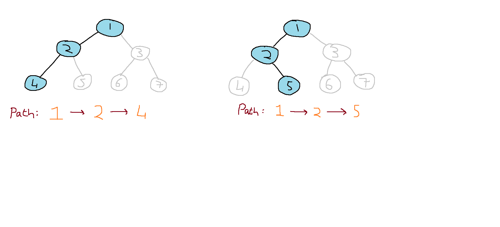

# Lowest Common Ancestor
Our first Software Engineering task is to implement finding the lowest common ancestor in a binary tree in two separate languages. For this task I chose Python and C.

## Problem Description

Given a binary tree and two nodes, we are tasked with finding the lowest common parent of both nodes in the given binary tree. As seen in the diagram below, the lowest common ancestor of node 4 and node 5 is node 2 as both 4 and 5 share this node higher up in the binary tree.

## Solution
My solution to this problem was the same in both my Python and C implementation. The algorithm used has a time complexity of O(n). 
First a path is found to the first node passed into the algorithm. The findPath algorithm is called and starting from the root, the algorithm visits children nodes from the root until it arrives at the desired node while storing every node it visited in an array. 
The same process is repeated for the second node passed into the algorithm. Once two paths to each of the nodes has been found the paths are compared and the lowest common ancestor will be the node right before the two path arrays start to differ.

